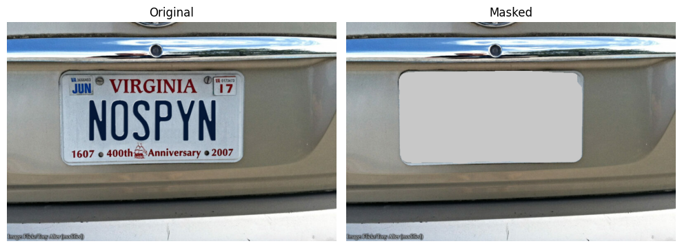
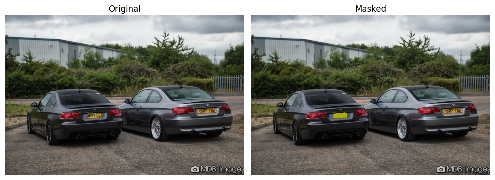

# Lightweight License Plate Segmentation & Masking

**Lightweight (≈7mb)** TFLite Pretrained **License Plate Segmentation** model + **Masking** example.




## Models

- **Download** TFLite (≈7mb): https://github.com/amirreza-hos/tflite-license-plate-segmentation/releases/download/v1.0/plate_seg_unet_mobilenetv2_quant_dynamic.tflite
- **Download** Keras (≈90mb): https://github.com/amirreza-hos/tflite-license-plate-segmentation/releases/download/v1.0/plate_seg_unet_mobilenetv2.h5

- Architecture: **U-Net** + **mobilenetv2** backbone, sigmoid output, `8,047,441` parameters
- Framework: **TFLite** & Keras
- Quantization: **Dynamic Range Quantization** (TFLite model)
- Dataset: **open-images-v7**, `Vehicle registration plate` class
- Input: `512*512*3`, RGB, Normalized
- Output: `512*512*1`, 0/1 Labels
- Evaluation (TFLite model):
    - Mean IoU: 0.5898
    - Mean Dice: 0.6450
    - Accuracy: 0.9943

## Examples

### Masking with TFLite model (≈7mb)

```python
import numpy as np
import tensorflow as tf
import matplotlib.pyplot as plt

# TFLite setup

model_path = "unet_mobilenetv2_quant_dynamic.tflite"

interpreter = tf.lite.Interpreter(model_path=model_path)
interpreter.allocate_tensors()

input_details = interpreter.get_input_details()
output_details = interpreter.get_output_details()
input_shape = input_details[0]['shape'][1:3]

# Image preprocessing

image_path = "image2.jpg"
image_data = tf.io.read_file(image_path)  # read raw bytes
image = tf.io.decode_image(image_data, channels=3) # decode supported images (JPEG/PNG/BMP/GIF)
original_shape = image.shape

image_resized = tf.image.resize(image, input_shape)
image_normalized = image_resized / 255.0
image_batched = tf.expand_dims(image_normalized, axis=0)

# Predict

interpreter.set_tensor(input_details[0]['index'], image_batched)
interpreter.invoke()
outputs = interpreter.get_tensor(output_details[0]['index'])

# Output processing

output = outputs[0] # (1, 512, 512, 1) to (512, 512, 1)
mask = (output > 0.5).astype(np.uint8) # probabilities to 0/1 labels
mask = tf.image.resize(mask, (original_shape[0], original_shape[1]), method="nearest") # (512, 512, 1) to (y, x, 1)

mask = tf.tile(mask, [1, 1, 3]) # (y, x, 1) to (y, x, 3)
NOT_mask = 1 - mask
# changing the color of mask to Yellow-ish (RGB = 170, 170, 1)
# channel_multiplier = tf.constant([170, 170, 1], dtype=tf.uint8)
# changing the color of mask to White-ish (RGB = 200, 200, 200)
channel_multiplier = tf.constant([200, 200, 200], dtype=tf.uint8)
mask = mask * channel_multiplier
# apply the mask to the image
"""
image * NOT_mask: NOT_mask has values of 0 where there's licene plate. 
                  So this element-wise multiplication, creates a new image,
                  which the value is 0 where there's license plate. 

+ mask:           mask has values of 0 where there's NO license plate, 
                  so adding it to the new image, only changes the color
                  of where there's license plate.
"""
masked_image = image * NOT_mask + mask

# plot before and after image

plt.figure(figsize=(10, 5))

plt.subplot(1, 2, 1)
plt.imshow(image)
plt.axis('off')
plt.title('Original')

plt.subplot(1, 2, 2)
plt.imshow(masked_image)
plt.axis('off')
plt.title('Masked')

plt.tight_layout()
plt.show()
```

### Loading original Keras model (≈90mb)

```python
import tensorflow as tf
import os
os.environ['SM_FRAMEWORK'] = 'tf.keras' # checkout segmentation_models instructions
from segmentation_models.losses import bce_dice_loss
from segmentation_models.metrics import iou_score

# Model load

model_path = "unet_mobilenetv2.h5"

model = tf.keras.models.load_model('unet_mobilenetv2.h5', custom_objects={
    'bce_dice_loss': bce_dice_loss,
    'iou_score': iou_score,
    'binary_crossentropy_plus_dice_loss': bce_dice_loss
})
```

### Preprocessing Open Images V7 Dataset + `fiftyone` for segmentation

```python
import fiftyone
import tensorflow as tf
import numpy as np
import cv2

train_dataset = fiftyone.zoo.load_zoo_dataset(
    "open-images-v7",
    split="train",
    label_types=["segmentations"],
    classes=["Vehicle registration plate"],
    # max_samples=24
)

val_dataset = fiftyone.zoo.load_zoo_dataset(
    "open-images-v7",
    split="validation",
    label_types=["segmentations"],
    classes=["Vehicle registration plate"],
    # max_samples=8
)

def preprocess_sample(sample):
    # obtain image

    img = tf.io.read_file(sample["filepath"])
    img = tf.image.decode_jpeg(img, channels=3)

    image_height = img.shape[0]
    image_width = img.shape[1]

    # obtain mask

    full_mask = np.zeros((image_height, image_width), dtype=np.uint8)
    for detection in sample.ground_truth.detections:
            if detection.label == 'Vehicle registration plate':
                bbox = detection.bounding_box
                mask = detection.mask.astype(np.float32)

                x_min, y_min, w, h = bbox
                # Convert to absolute coordinates
                x_min = x_min * image_width
                y_min = y_min * image_height
                w_px = w * image_width
                h_px = h * image_height
                # Convert [x_min, y_min, w, h] → [x_min, y_min, x_max, y_max]
                x_max = x_min + w_px
                y_max = y_min + h_px

                resized_mask = cv2.resize(mask, (int(w_px), int(h_px)), interpolation=cv2.INTER_NEAREST)
                x_min, y_min = int(x_min), int(y_min)
                full_mask[y_min:y_min+resized_mask.shape[0], x_min:x_min+resized_mask.shape[1]] = resized_mask

    # preprocess image

    img = tf.image.resize(img, (512, 512))
    # img = img / 255.0  # Normalize
    # only for segmentation_models
    img = preprocess_input(img)

    # preprocess mask

    # convert (height, width) to (height, width, 1)
    full_mask = tf.expand_dims(full_mask, axis=-1)
    full_mask = tf.image.resize(full_mask, (512, 512), method="nearest")

    return img, full_mask

# Convert FiftyOne samples to TF Dataset
tf_train_dataset = tf.data.Dataset.from_generator(
    lambda: (preprocess_sample(s) for s in train_dataset),
    output_signature=(
        tf.TensorSpec(shape=(512, 512, 3), dtype=tf.float32),  # Image
        tf.TensorSpec(shape=(512, 512, 1), dtype=tf.float32),  # Mask
    )
)
tf_val_dataset = tf.data.Dataset.from_generator(
    lambda: (preprocess_sample(s) for s in val_dataset),
    output_signature=(
        tf.TensorSpec(shape=(512, 512, 3), dtype=tf.float32),  # Image
        tf.TensorSpec(shape=(512, 512, 1), dtype=tf.float32),  # Mask
    )
)

# Batch and shuffle
tf_train_dataset = tf_train_dataset.batch(4).prefetch(tf.data.AUTOTUNE)
tf_val_dataset = tf_val_dataset.batch(4).prefetch(tf.data.AUTOTUNE)
```

## Limitations

1. Problem segmenting multiple license plates in a single image.

## Useful Resources

- Segmentation library: https://github.com/qubvel/segmentation_models

- Interesting Examples: https://github.com/dbpprt/pytorch-licenseplate-segmentation

